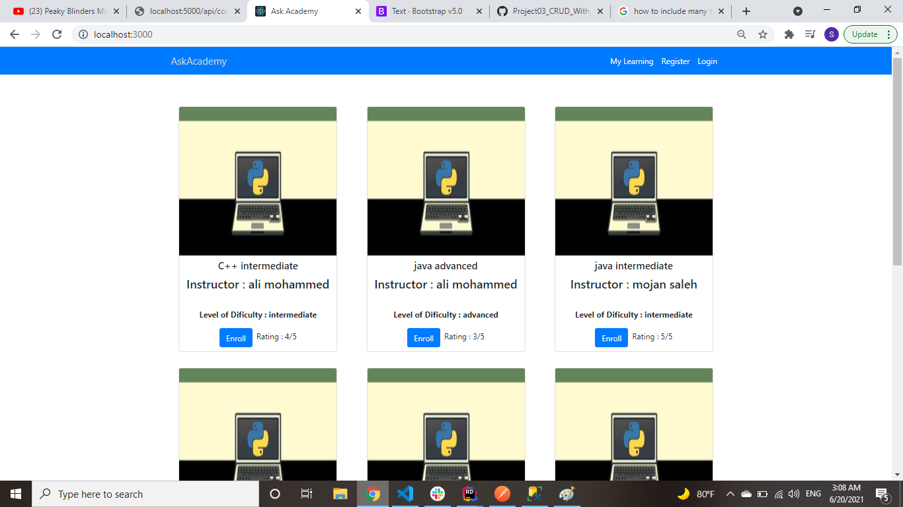
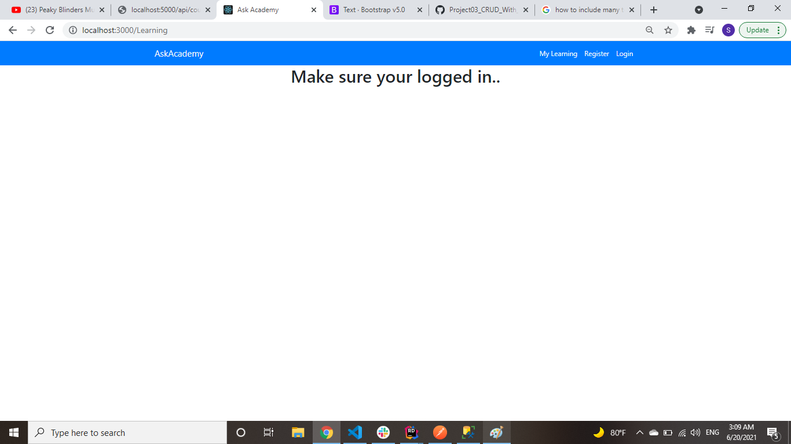
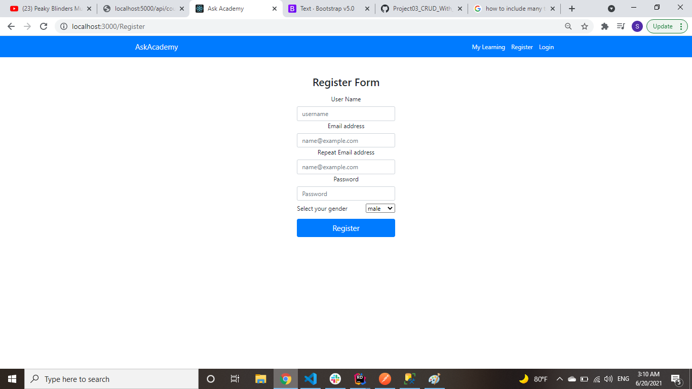
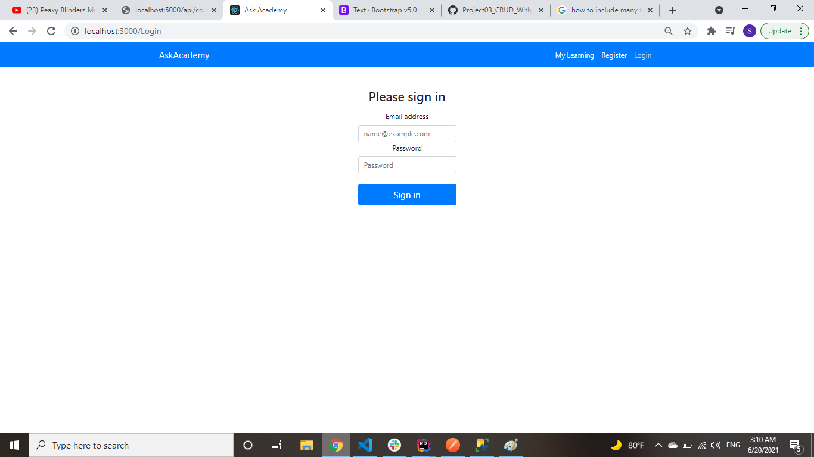
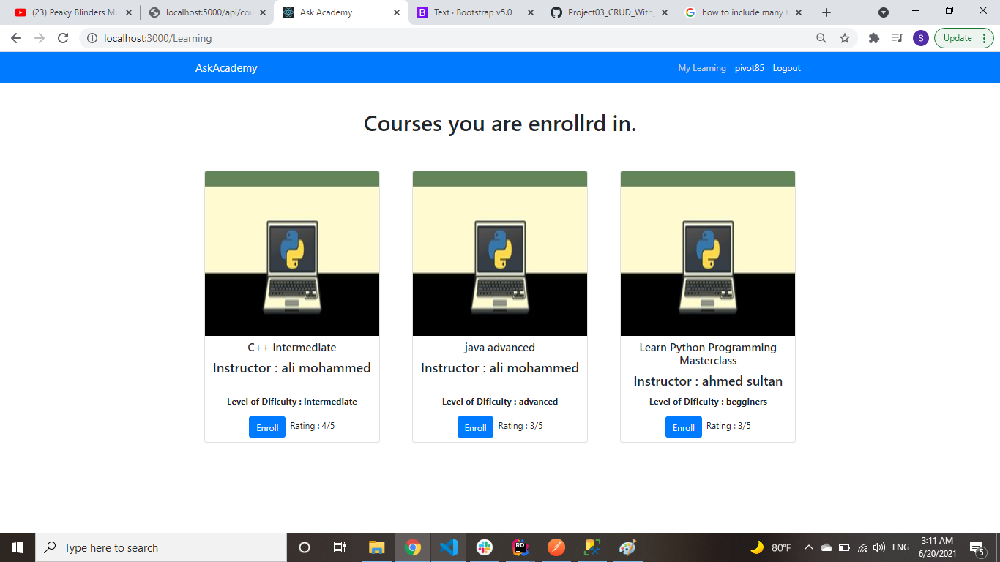
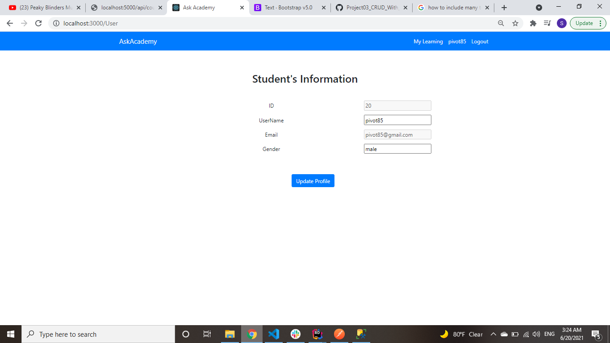
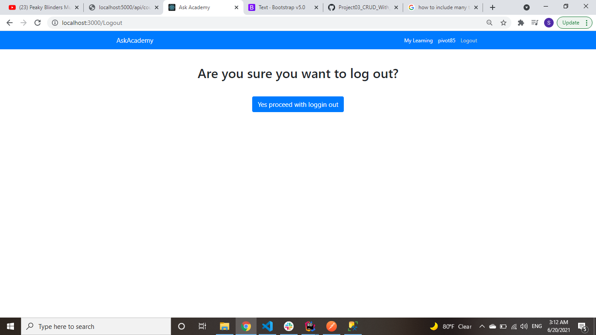

# Final Project | المشروع النهائي

  
  

  
  
  
 

  
مصدر (API): https://jsonplaceholder.typicode.com/
  
مصدر (FireBase Auth): https://react-firebase-js.com/docs/react-firebase-auth/getting-started
  
مصدر لرفع المشروع على (github): https://github.com/gitname/react-gh-pages
  
  

