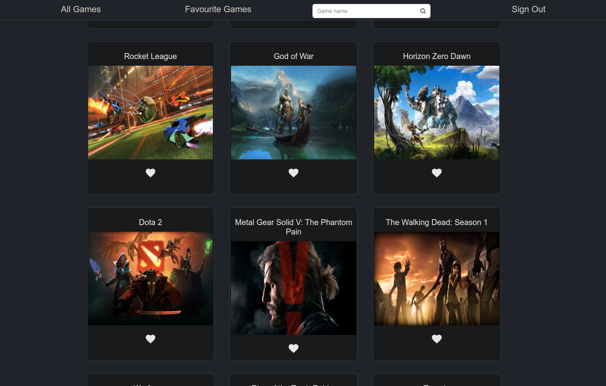
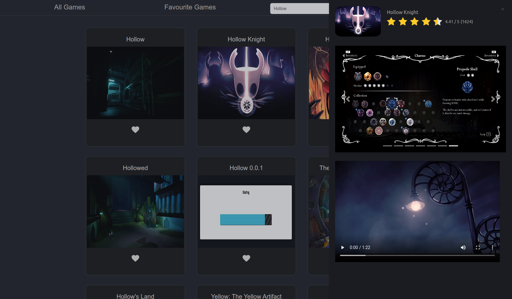
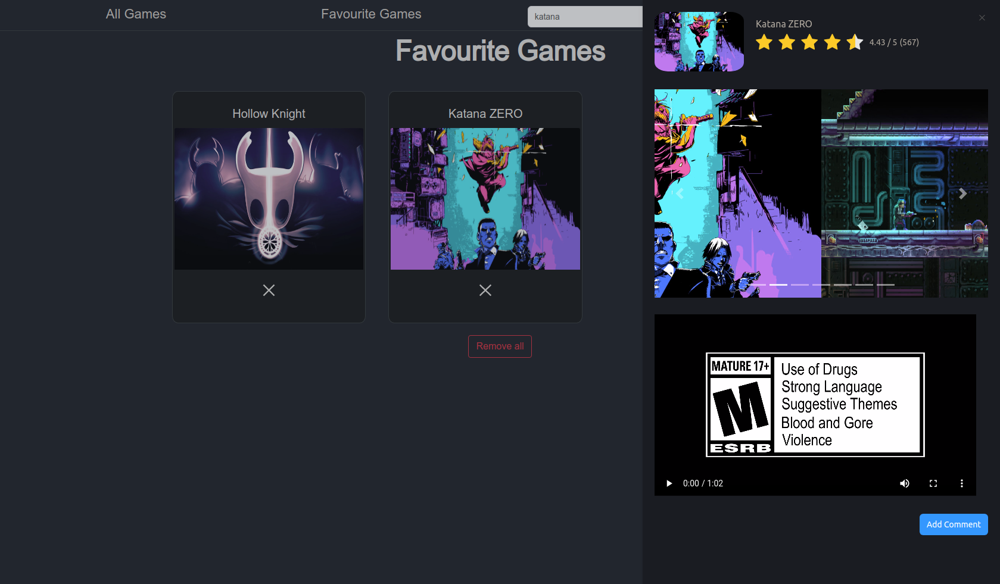

# GG
### A video games library
A video game website that allow you to add, remove, edit
and clear games and Mark it as complete/favorite and many more

## Getting Started
To run this project on your local machine, fork and clone the repo from github.  
Install all dependencies by running `npm i` in the project directory terminal.  
Run `npm start` to start your frontend. 

#

#

#

   

# Features
- [x] listing Games from game api
- [x] searching Games by title
- [x] add games to your favorite list
- [x] manage your favorite list
   

## Searching 
type the title of the Game in search bar
  

## Favorite List
Press the `<3` button on the game to keep it into favorite list.\
You can checkout the favorite list by clicking on the fav games bar\
press `x` to remove it from favorite list
  

## Game Details
Click on the game to see more info
   

# Technologies used 
- HTML
- CSS
- js
- React
- Axios
- Node
- React-bootstrap
- Firebase Sign-in Providers (Google)
 

## API REFERENCE
 API | Method | Router | URL
-----|--------|--------|-----
rawg| GET    | /games  | https://api.rawg.io/api/games
