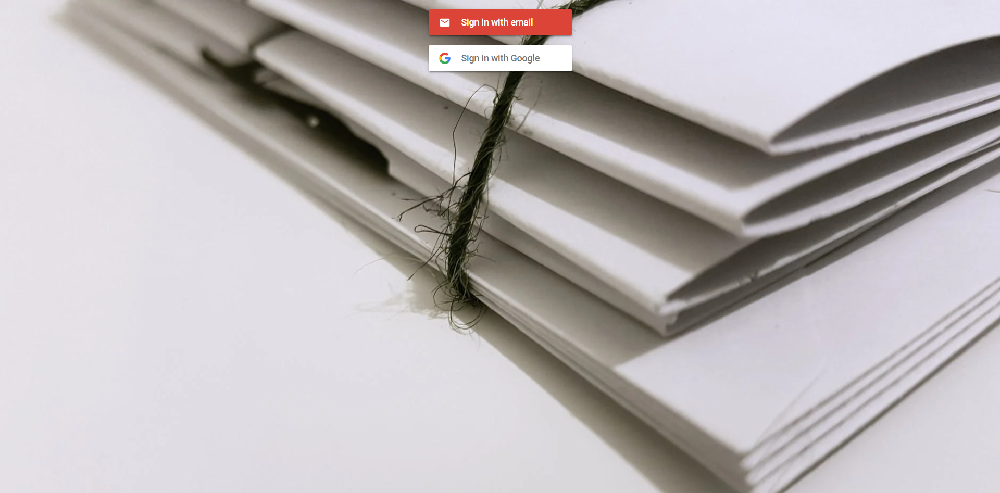

# Final Project | المشروع النهائي

  
  
## مقدمة 

موقع يعرض إقتباسات من الشعر العربي الفصيح 

## صور من الموقع

## لبدأ الإستخدام 

`
git clone https://github.com/mohammed-tu/FinalProject.git
`

`
npm i
`

`
npm i react-router-dom react-bootstrap firebase react-firebaseui
`

## التقنيات المستخدمه

- HTML
- CSS
- js
- React
- React-bootstrap
- Firebase

  

